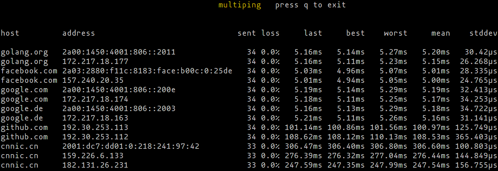

# multiping

Just like regular `ping`, but measures round trip time to multiple
hosts, all at once.

The user interface is similar to [mtr](https://www.bitwizard.nl/mtr/):




## Installation

Installing is as easy as:

```
$ go get -u github.com/digineo/go-ping/cmd/multiping
```

This will download and build this program and install it into `$GOPATH/bin/`
(assuming you have the Go toolchain installed).

To run it, you need elevated privileges (as mentioned in the
[README of ping-test](../ping-test)). You can either run it as root (or
via `sudo`; both not recommended), or enable the program to only open
raw sockets (via `setcap`, but Linux-only):

```
$ sudo setcap cap_net_raw+ep $GOPATH/bin/multiping
```

## Running

Assuming `$GOPATH/bin` is in your `$PATH`, just call it with a list
of hosts and IP addresses (currently only IPv4):

```
$ multiping golang.org google.com 127.0.0.1
```

### Options

To get a list of available options, run `multiping -h`:

```
Usage of ./multiping:
  -bind4 string
    	IPv4 bind address (default "0.0.0.0")
  -bind6 string
    	IPv6 bind address (default "::")
  -buf uint
    	buffer size for statistics (default 50)
  -interval duration
    	polling interval (default 1s)
  -resolve duration
    	timeout for DNS lookups (default 1.5s)
  -s uint
    	size of payload in bytes (default 56)
  -timeout duration
    	timeout for a single echo request (default 1s)
```

## Roadmap

- [x] cleanup UI code (this is a bit of a mess)
- [ ] add more features
  - [ ] different display modes (`mtr` has different views)
  - [x] move "last error" column into a log area at the bottom
  - [ ] increase/decrease interval and/or timeout with `-`/`+` keys
- [x] fill IPv6 options with life (once the library has IPv6 support)
- [x] use something more sophisticated than `net.ResolveIPAddress` to
  get a list of all A/AAAA records for a given domain name
  - [ ] this propably needs an off-switch
